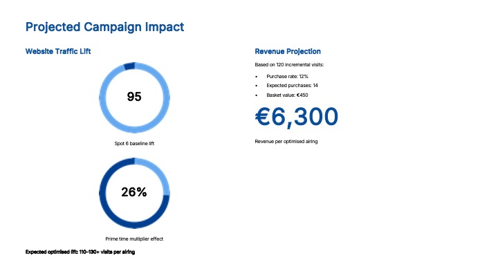
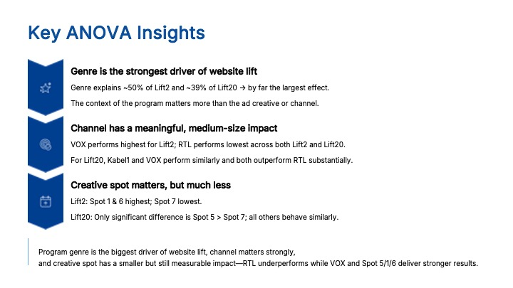
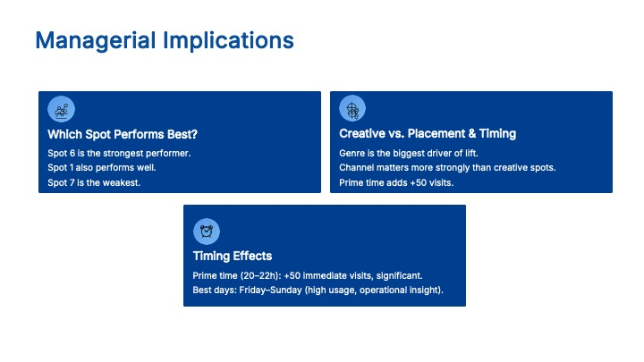
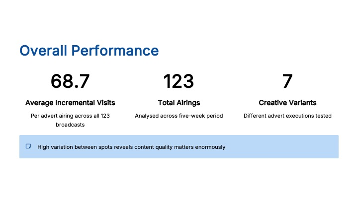

# ✈️ VaycayNation: TV Campaign Performance Analytics

**Harvard Business School Case Study | MSc Business Analytics, Qatar University**

---

## Business Problem

German travel start-up with a 90% conversion rate among aware customers but only 10% brand awareness.  
Objective: identify what drives incremental website traffic lift from TV advertising to inform summer campaign strategy.

---

## Approach

- **Dataset:** 123 ad airings across a 5-week period (Dec 2017 – Jan 2018)  
- **Variables:** 7 creatives, 3 channels, 20 programme genres, time of day, day of week  
- **Methods:** ANOVA, multiple regression, feature engineering, dummy variable encoding  
- **Tools:** SPSS, Excel, PowerPoint  

---

## Key Findings

- Programme genre explains ~50% of lift variance — stronger than channel or creative  
- Prime time (20:00–22:00) adds ~+50 incremental visits per airing *(p = 0.022)*  
- VOX outperforms all channels, RTL consistently underperforms  
- Spot 6 is the strongest creative, Spot 7 is the weakest  
- Projected **€6,300 revenue per optimised airing** based on conversion modelling  

---

## 📊 Selected Analysis Outputs

### Campaign Performance Overview (123 airings, avg. lift = 68.7)

### Key Drivers of Traffic Lift (ANOVA Insights)

### Optimised Media Strategy (Managerial Implications)

### Projected Campaign Impact (€6,300 per airing)

---

## Recommendations

- Deploy **Spot 6** as primary creative execution  
- Prioritise **prime time slots (20:00–22:00), especially Friday–Sunday**  
- Allocate budget to **VOX and Kabel1**, avoid RTL  
- Focus on **Romance and Family genres** for highest lift  

---

## Files

- `vaycaynation_campaign_analytics.pptx` — Full analysis and recommendations deck  

---

## Note on Data

Raw case data is not included as it is proprietary to Harvard Business School Publishing.
